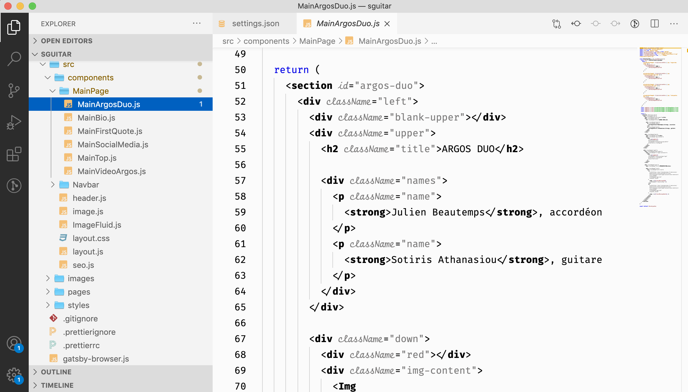

# README.md

## VSCODE - Alector settings / adaptation on NetBeans

Here you can find my personalised settings `settings.json` to adapt the the [NetBeans Light Theme](https://marketplace.visualstudio.com/items?itemName=obrejla.netbeans-light-theme#:~:text=This%20VS%20Code%20Theme%20extension%20tries%20to%20setup,Currently%20supported%20languages%3A%20JavaScript%20%28JSON%29%20TypeScript.%20HTML.%20CSS.).

The objective is to make JSX (in ReactJS) more readable, by highlighting the html elements inside the JSX code. It’s still a work in progress.

